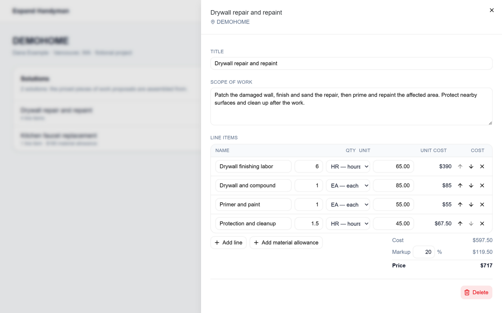
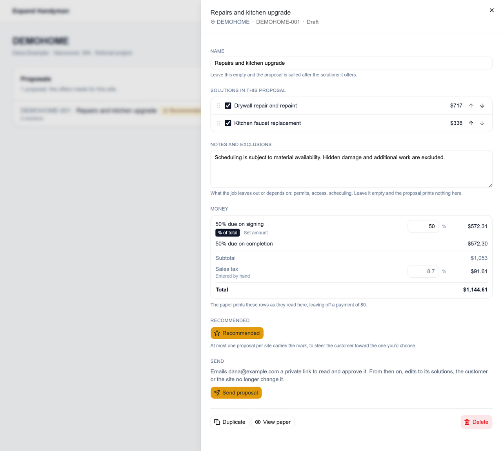
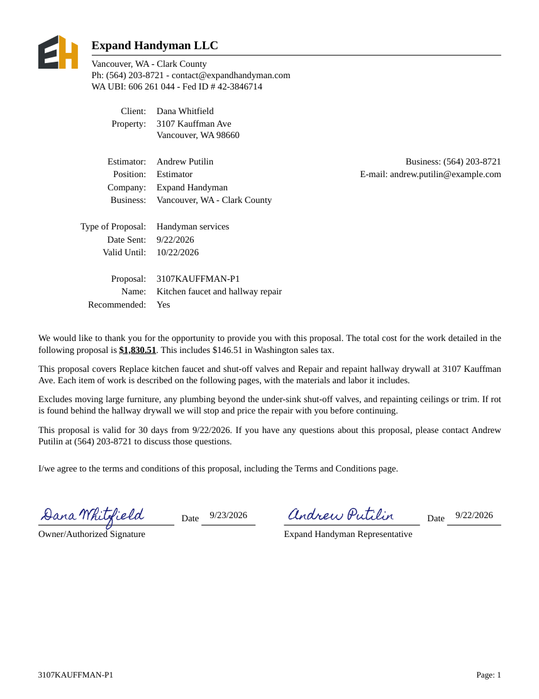
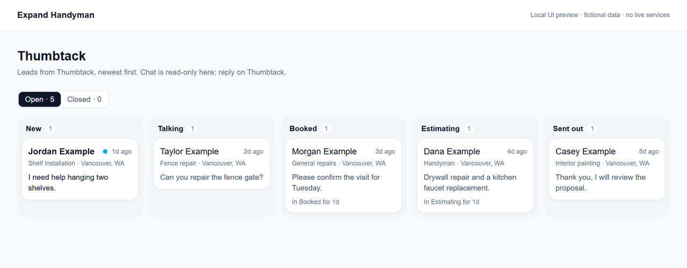
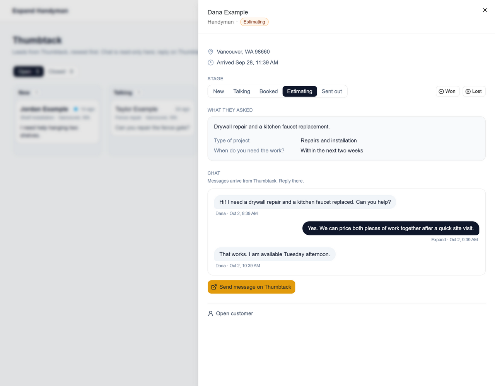
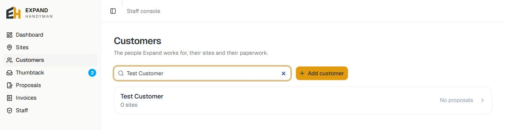
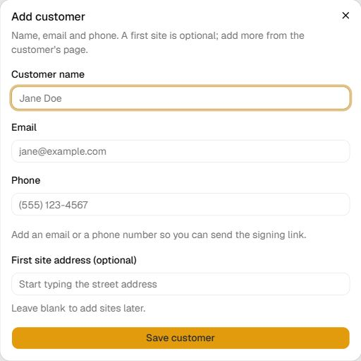

# Expand Handyman

A business operations app for taking handyman work from a customer request to a
priced proposal, approval, invoices, and payment tracking. Built and maintained by
[Andrew Putilin](https://github.com/bigapejit) with TypeScript, React, Next.js,
Convex, Clerk, and Stripe.

The app is used at [staff.expandhandyman.com](https://staff.expandhandyman.com).
That deployment contains business data and requires an authorized staff account.
To explore the project, start with the screenshots and tests below, or run your
own instance using [the setup guide](docs/local-setup.md).

## What it does

- **Customers and sites:** contact records, Google Places address lookup, and site photos.
- **Pricing and proposals:** materials/labor cost buildup, multiple solutions, tax,
  exclusions, payment terms, and customer approval through a private link.
- **Approval records:** a frozen offer, typed electronic signatures, view history,
  and a SHA-256 fingerprint on the signed proposal's completion certificate.
- **Invoices and payments:** deposit/final invoices, Stripe Checkout, and webhook
  handling for payment confirmations, bank returns, refunds, and disputes.
- **Uploaded documents:** any other PDF uploaded, with signature and date fields
  placed by hand, signed through the same kind of private link and saved as a
  verified signed PDF.
- **Operations:** a Thumbtack lead pipeline with read-only chat, and staff invitations
  and access management.

The main workflow is:

**Customer/site → priced solutions → proposal → customer approval → deposit invoice
→ job completion → final invoice → payment tracking.**

## Screenshots

### Building an estimate

These estimating and Thumbtack screenshots render the **current application
components with fictional data in an isolated local preview**. They demonstrate
the UI without connecting to production services or displaying customer records.

**1. Price each piece of work as a solution.** Enter the scope, quantities,
units, and unit costs for materials, labor, and other expenses. The editor
calculates the cost buildup and markup as you type. A material allowance can
be added separately; it is not marked up.



In this example, four line items cost **$597.50**. With **20% markup**, the
solution's price is **$717**. Prices round up to the whole dollar before any
material allowance is added. The editor and backend share the same
[pricing rules](lib/solution-pricing.ts).

**2. Assemble the customer proposal.** Choose and order solutions, add notes
and exclusions, set the deposit as a percentage or fixed amount, and review
tax and totals. A site can have multiple proposal options, with one marked
as recommended.



The two solutions here total **$1,053** before the example tax, with a **$1,144.61**
total split into a **$572.31** deposit and **$572.30** balance. Sending freezes
the offer and emails a private approval link, so later edits do not rewrite
what the customer was offered.

**3. Deliver the proposal and record approval.** The generated paper includes
scopes, prices, payment terms, and the customer's decision. The separate PDF
example below uses fictional customer data and a simulated approval; its
signature and dates are fixture values:



Full sample PDFs: [draft proposal](docs/prints/proposal-paper/two-solution-taxed-draft.pdf),
[small job](docs/prints/proposal-paper/under-1000-draft.pdf), and
[approved proposal](docs/prints/proposal-paper/approved-notice-acknowledged.pdf).

### Thumbtack leads and conversations

Thumbtack webhooks bring leads and messages into Convex. Incoming leads are
matched to customer records, and duplicate deliveries are handled without
duplicating the lead or message. The board follows **New → Talking → Booked →
Estimating → Sent out**, with **Won/Lost** in the closed view. Staff can move
cards between stages or use the lead panel's stage controls.



Opening a lead shows the request, project answers, location, any supplied
attachments, and synced customer/business messages. **Chat is read-only in
this app**; the reply button opens the conversation on Thumbtack. The panel
also links to the customer record, where staff can continue to the site's
estimate and proposal workflow.



Some transitions happen automatically: a customer reply moves a New lead to
Talking after the business has replied; sending a proposal moves that
customer's open leads to Sent out; approval moves their open leads to Won.
Already closed leads stay closed. See the [webhook and lead handlers](convex/leads.ts)
and [stage rules](lib/thumbtack.ts).

<details>
<summary>Customer records and creation form</summary>

Current customer view, filtered to an existing test record:



Customer creation form, captured empty without saving a record:



</details>

## Review and run the tests

With Node.js **20.9 or newer** and npm installed:

```sh
git clone https://github.com/bigapejit/expand-handyman-RP.git
cd expand-handyman-RP
npm ci
npm test
npm run typecheck
```

The automated tests use local Convex test fixtures and stub external services;
they do not require production credentials or live service accounts. The reviewed
version has **945 passing tests across 48 files**. Coverage includes staff access
and revocation, frozen proposals and signatures, uploaded-document signing, invoice lifecycle, photos, PDF
rendering, and duplicate/out-of-order Stripe webhook events.

To use the interactive app, follow [local setup](docs/local-setup.md). It requires
your own Clerk development application and Convex project. Additional integrations
can be configured as you need their features.

## Architecture and code guide

| Area | Implementation |
| --- | --- |
| Web app | Next.js App Router, React, TypeScript, Tailwind, shadcn/Base UI |
| Backend and data | Convex functions, schema, file storage, and scheduled actions |
| Authentication | Clerk sign-in; Convex enforces staff membership on protected operations |
| Payments | Stripe-hosted Checkout and signature-verified webhooks |
| Other integrations | Google Places, Resend email, Cloudflare PDF rendering, Thumbtack webhooks |
| Tests | Vitest and convex-test, with external calls stubbed |

- [`app/`](app): staff pages, customer signing/invoice pages, and paper views.
- [`components/`](components): forms, staff navigation, proposal/invoice UI, and paper rendering.
- [`convex/`](convex): data model, access rules, workflows, and integration handlers.
- [`lib/`](lib): pricing, signing, validation, and other shared rules.
- [`tests/`](tests): backend/workflow tests; additional unit tests live beside rules in `lib/`.
- [`CONTEXT.md`](CONTEXT.md): domain vocabulary and workflow definitions.
- [`docs/adr/`](docs/adr): decisions about view tracking, on-demand PDFs, and photo storage.

UI primitives, navigation, and the customer signing interaction are adapted from
my [FRSG project](https://github.com/bigapejit/frsg-app). The issues, commits, and PRs
in this repository show the application's development history.

## Access and deployment

Staff access is invite-only in the business deployment. All admitted staff have
the same application permissions; the app does not implement separate staff roles.
Customer signing and invoice links are bearer credentials: possession of a link
grants access to its customer-facing record. Share them only with the intended
customer. Customer links do not require a separate login or independently verify
the signer's identity.

Production Vercel builds run `npx convex deploy` through [`vercel.json`](vercel.json),
deploying the frontend and backend together from `main`. A fork uses its own
service accounts, environment variables, and data. See [local setup and deploying
your own copy](docs/local-setup.md) and the existing business deployment's
[operational notes](docs/deployment.md).

## License

Project source code is licensed under the [MIT License](LICENSE).

Third-party dependencies and assets retain their respective licenses. The bundled
fonts retain their [Homemade Apple license](public/fonts/HomemadeApple-LICENSE.txt)
and [Tinos license](public/fonts/Tinos-OFL.txt).
